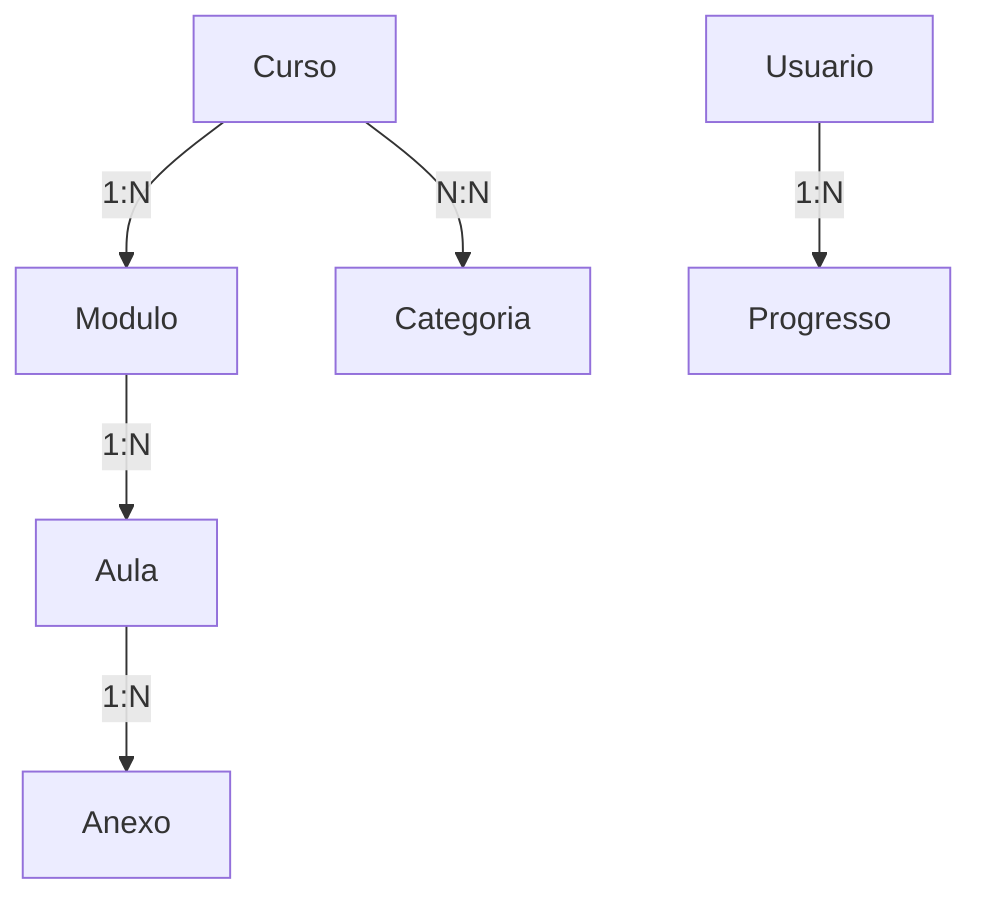

# Plataforma de Cursos Streaming - Estilo Netflix e Udemy


## Descrição do Projeto
Uma plataforma de cursos online que combina a experiência visual de uma vitrine estilo Netflix com a organização de conteúdo estilo Udemy. O objetivo é fornecer uma interface intuitiva para os alunos acessarem cursos, módulos e aulas, além de um painel administrativo para gestão de conteúdo.

## Principais Funcionalidades
- **Vitrine de Cursos**: Exibição de cursos em formato carrossel, com botão para favoritar e categorias destacadas.
- **Interior do Curso**: Player de vídeo ou PDF integrado, organização por módulos e aulas.
- **Painel Administrativo**: Cadastro e gestão de cursos, módulos e aulas.
- **Integrações**: Autenticação via `orchestrator_api` e pagamentos via `market_api`.

---

## Análise e Requisitos

### Requisitos de Sistema
1. **Front-End**:
   - Node.js
   - Next.js
2. **Back-End**:
   - Python (FastAPI)
   - Toolkit interno com Poetry
3. **Banco de Dados**:
   - PostgreSQL
4. **Infraestrutura**:
   - AWS (EC2, S3, Cognito)

### Requisitos Funcionais
- Cadastro e organização de cursos, módulos e aulas.
- Exibição de uma vitrine intuitiva.
- Controle de acesso e permissões via UUID (Autenticação).
- Integração com serviços externos para gestão de pagamentos.

### Requisitos Não Funcionais
- Desempenho otimizável para grandes volumes de usuários.
- Layout responsivo.
- Segurança para dados de usuários e transações.

---

## Diagrama do Banco de Dados



### Principais Tabelas
1. **Curso**
   - id (UUID)
   - nome
   - descricao
   - capa
   - status
2. **Modulo**
   - id (UUID)
   - titulo
   - curso_id
3. **Aula**
   - id (UUID)
   - titulo
   - tipo (video/PDF)
   - url_conteudo
   - modulo_id
   - data_liberacao
4. **Usuario**
   - id (UUID)
   - nome
   - email
5. **Progresso**
   - id (UUID)
   - usuario_id
   - curso_id
   - modulo_id
   - aula_id
   - progresso (%)

---

## Estrutura de Pastas do Projeto

```plaintext
algoricca-plataforma-cursos/
├── backend/
│   ├── app/
│   │   ├── main.py
│   │   ├── models/
│   │   ├── routers/
│   │   └── services/
│   ├── alembic/
│   └── Dockerfile
├── frontend/
│   ├── pages/
│   ├── components/
│   ├── public/
│   └── Dockerfile
├── bd/
│   ├── backups/
│   └── scripts/
├── docker-compose.yml
├── .env
└── README.md
```

---

## Passo a Passo para Criar o Projeto

### 1. Configurar Ambiente de Desenvolvimento
1. **Instalar Dependências:**
   - Docker
   - Docker Compose
2. **Clonar o Repositório:**
   ```bash
   git clone https://github.com/seu-repositorio/algoricca-plataforma-cursos.git
   cd algoricca-plataforma-cursos
   ```
3. **Configurar Variáveis de Ambiente:**
   - Criar um arquivo `.env` para as credenciais do banco de dados, AWS e APIs externas.

### 2. Configurar e Executar com Docker
1. **Criar a Stack com Docker Compose:**
   - Certifique-se de que o Docker esteja instalado e funcionando.
   ```bash
   docker-compose up --build
   ```
2. **Serviços Disponíveis:**
   - Backend: `http://localhost:8000`
   - Frontend: `http://localhost:3000`

### 3. Testes e Deploy
1. **Testar Localmente:**
   - Acessar o Frontend em: `http://localhost:3000`
   - Acessar o Backend em: `http://localhost:8000/docs`
2. **Configurar Deploy:**
   - Utilizar AWS para deploy do Backend e Frontend.
   - Configurar CI/CD para automação.

---

## Contribuições
Contribuições são bem-vindas! Para colaborar:
1. Faça um fork do repositório.
2. Crie uma branch para sua feature (`git checkout -b feature/nova-feature`).
3. Envie um pull request.

---

## Licença
Este projeto está licenciado sob a [MIT License](LICENSE).